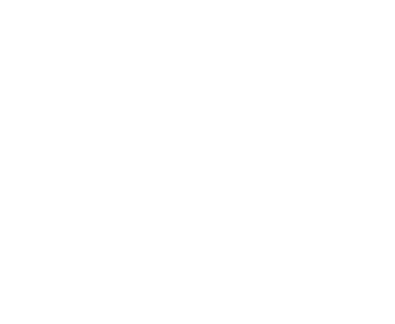
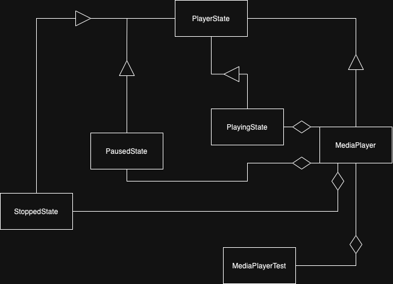

# MediaPlayer

## Overview

**MediaPlayer** This is an example of a Media Player application implemented using the State Design Pattern. The application allows users to play, pause, and stop media playback. The state design pattern is employed to manage the transitions and behavior of the media player as it progresses through various states during media playback.

**The State Design Pattern** is employed to ensure that the media player behaves differently depending on its state. The key states and their responsibilities are defined in the PlayerState abstract class.

## Features

The media player follows the State Design Pattern to transition between different states, namely stopped, playing, and paused. Each state defines specific behavior and rules.

Play, Pause, and Stop: Users can control the media playback by playing, pausing, or stopping the media.

State Transitions: The media player correctly transitions between states, ensuring that actions are valid according to the current state.

Time Tracking: The media player keeps track of the playback time, updating it correctly based on user interactions.

### Attributes and Functions

`State` : The current state of the media player, determining its behavior.
`Time`: The current playback time, managed by the active state.
`Play()` : Plays the media, transitioning to the Playing state.
`Pause()` : Pauses the media, transitioning to the Paused state.
`Stop()` : Stops the media, transitioning to the Stopped state.

### States

`StoppedState` : The media player is stopped. The only transition possible is to `PlayingState`.
`PlayingState` : The media is actively playing. Users can pause or stop playback.
`PausedState` : The media is paused. Users can resume playing or stop playback.

### Context

Context is a class derived from the `MediaPlayer` class that handles the state transitions and interactions with the various playback states.

## Design

### State Diagram

### Dependency Diagram

# Environment
The project builds and runs with Visual Studio Community 2022.
